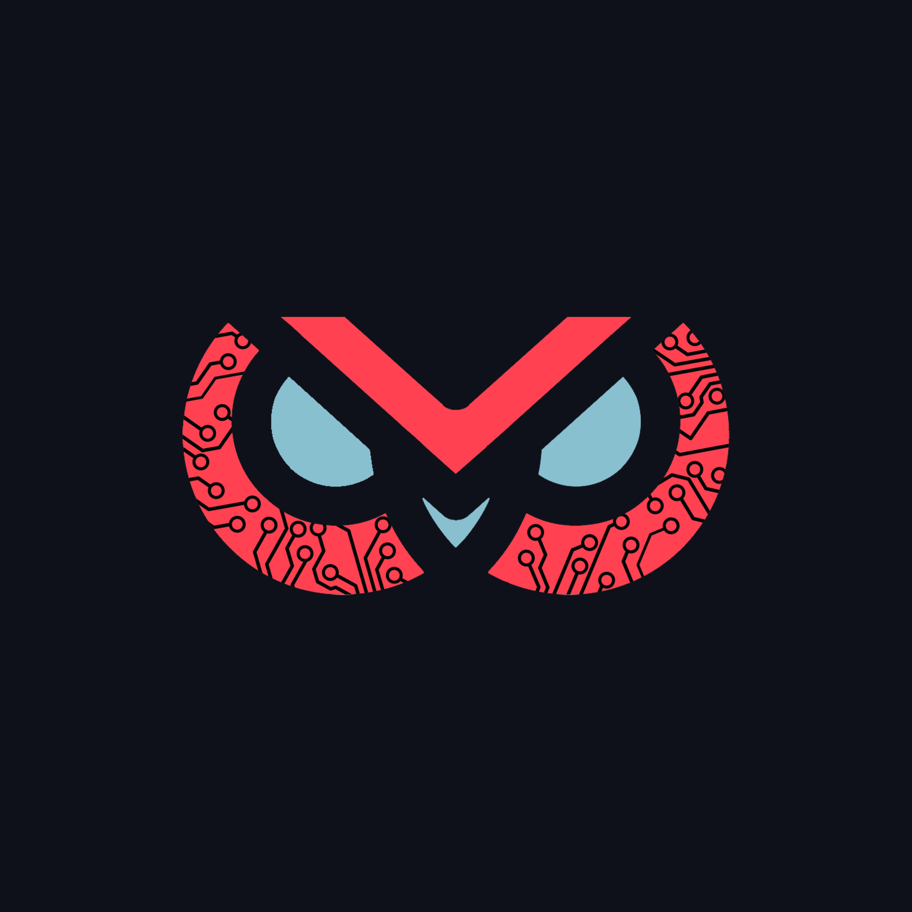

# OWL

  

##

OWL will eventually be an Android remote access tool.

## Project phases:

| Phase | Programming Language | Comment | Starting Date | Status |
| :-: | :-: | :-: | :-: | :-: |
| [Android APK (Calculator)](https://github.com/G4vr0ch3/OWL/tree/176251806a135763d58382e14d45e14652bae026) | Python | Developping an easy app. | 30/10/2022 | :green_circle: |
| [Android APK (Calculator)](https://github.com/G4vr0ch3/OWL/tree/2f957567811fe8ba51d5001710af5499c55d957f) | Java | Learning Android development. | 31/10/2022 | :green_circle: |
| Android APK (Calculator) | Kotlin | Learning Kotlin. | 03/01/2022 | :green_circle: |
| Android chat APK | Java/Kotlin | Developping a reacting app | - | :hourglass: |
| Android RCE APK | Java/Kotlin | Transforming the messenging in a remote code execution tool | - | :hourglass: |
| Android OWL APK | Java/Kotlin | Implementing functionnalities | - | :hourglass: |
| Android wepponized OWL APK | Java/Kotlin | From tool to malware | - | :hourglass: |

## Support

> 👋🏼 Hey everyone ! I provide free software, feel free to use it and edit it as you wish. I will also provide a bit of support should you need it when contacted through the contact channels specified below. Feel free to help me out as you can !

- ⭐️ You can help by hitting Star on the repositories you like !
- ☕️ You can buy me a [coffee](https://www.paypal.com/paypalme/AReppelin)
- ✨ Contributions of any kind are welcome!

## Contact details :

> -  [Gmail](mailto:gavrochebackups@gmail.com)
> -  [Discord](https://discordapp.com/users/Gavroche#2871)
